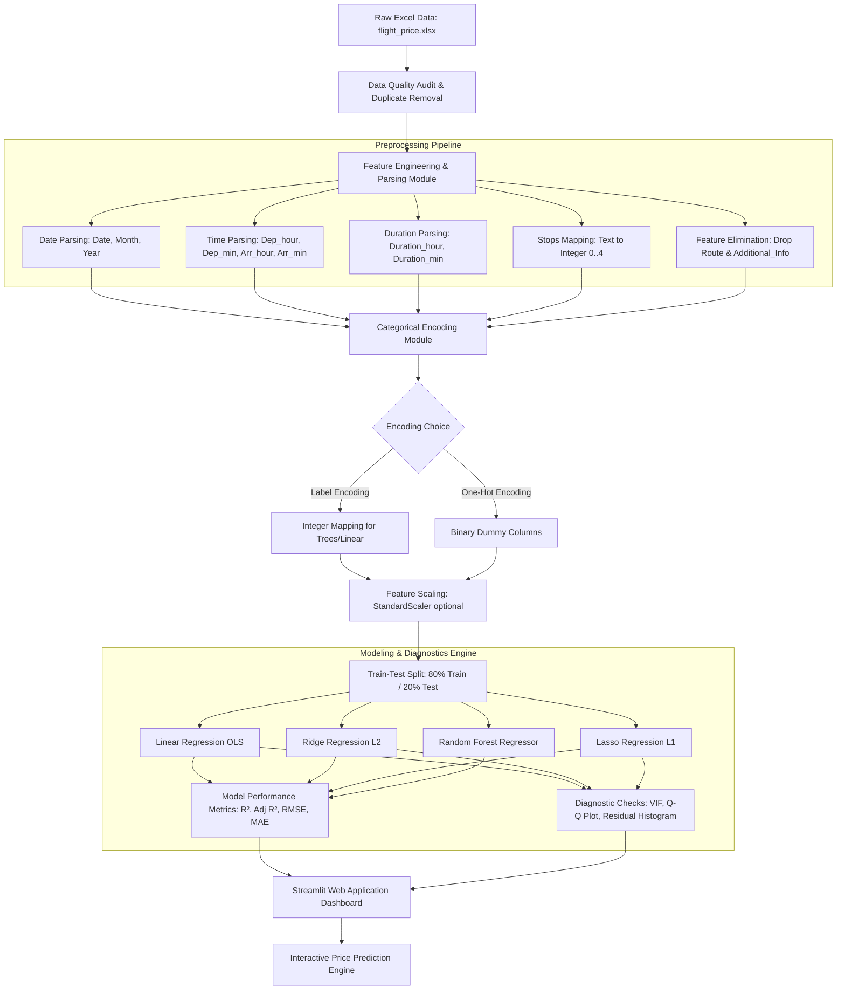

# ✈️ Flight Price Prediction System: Comprehensive Technical Project Report & Interview Masterclass

---

## 1. Executive Summary & Project Overview

### 1.1 Problem Statement
In the aviation industry, dynamic pricing mechanisms cause flight ticket prices to fluctuate rapidly based on seasonal demand, booking timing, route popularity, airline brand positioning, flight duration, and number of layovers. For travelers and travel platforms, predicting flight prices accurately is a high-value regression challenge. The goal of this project is to build an end-to-end Machine Learning solution that predicts flight ticket prices (in Indian Rupees - ₹) based on historic travel data, allowing users to analyze price drivers through interactive data visualizations and obtain real-time price predictions.

### 1.2 Core Objectives
- **Data Engineering**: Process raw aviation data containing complex date, time, and duration strings into clean, numeric feature vectors suitable for regression algorithms.
- **Exploratory Data Analysis (EDA)**: Uncover price distribution trends, seasonal anomalies, route dynamics, and feature correlations using interactive Plotly and Seaborn visualizations.
- **Predictive Modeling**: Train, benchmark, and evaluate multiple regression algorithms—including Ordinary Least Squares (OLS) Linear Regression, Regularized Regression (Ridge, Lasso), and Ensemble Tree-based models (Random Forest).
- **Diagnostic Analytics**: Conduct comprehensive regression diagnostic checks using Variance Inflation Factor (VIF) for multicollinearity analysis, Residual Distribution Analysis, and Normal Quantile-Quantile (Q-Q) plots.
- **Production Deployment**: Build a modular, multi-page Streamlit web dashboard enabling end-to-end data overview, customizable EDA, model performance comparison, and real-time interactive price predictions.

### 1.3 Industry Motivation & Real-World Applications
- **Travel Aggregators & Booking Engines**: Systems like Skyscanner, Kayak, and Google Flights utilize price prediction models to provide "Buy Now vs. Wait" recommendations to consumers.
- **Airline Revenue Management**: Airlines leverage inverse dynamic pricing models to optimize seat inventory allocation across booking classes.
- **Corporate Travel Budgeting**: Enterprises use flight price forecasting tools to estimate and optimize corporate travel expenses quarterly.

### 1.4 Challenges Addressed
1. **Unstructured String Formats**: Parsing dates (`"24/03/2019"`), times (`"22:20"`), and irregular duration strings (`"2h 50m"`, `"5m"`, `"19h"`).
2. **High Skewness in Target Variable**: Ticket prices display strong positive right-skewness due to premium business class tickets and holiday surcharges.
3. **Multicollinearity**: High correlation between feature pairs (e.g., `Duration` vs. `Total_Stops`), requiring diagnostic checks using VIF.
4. **Categorical Encoding Decisions**: Selecting appropriate encoding strategies (Label Encoding vs. One-Hot Encoding) based on model requirements without causing dimensionality explosion.

---

## 2. Dataset Blueprint & Data Schema

### 2.1 Dataset Source & Profile
- **Source**: Kaggle Flight Price Prediction Dataset (`flight_price.xlsx`).
- **Total Samples**: 10,683 rows (before cleaning).
- **Total Raw Features**: 11 predictor columns + 1 target column (`Price`).
- **Target Variable**: `Price` (Continuous Numerical in INR ₹).

### 2.2 Raw Dataset Feature Dictionary

| Feature Name | Raw Data Type | Domain Category | Description & Example Values |
| :--- | :--- | :--- | :--- |
| **Airline** | Categorical (`object`) | Categorical | Airline carrier name (e.g., *IndiGo, Air India, Jet Airways, SpiceJet*) |
| **Date_of_Journey** | String (`object`) | Temporal | Travel date formatted as `DD/MM/YYYY` (e.g., `"24/03/2019"`) |
| **Source** | Categorical (`object`) | Geographical | Departure city (e.g., *Banglore, Kolkata, Delhi, Chennai, Mumbai*) |
| **Destination** | Categorical (`object`) | Geographical | Arrival city (e.g., *New Delhi, Banglore, Cochin, Kolkata, Hyderabad*) |
| **Route** | String (`object`) | Flight Path | List of layover airports (e.g., `"BLR → DEL"`, `"CCU → IXR → BBI → BLR"`) |
| **Dep_Time** | String (`object`) | Temporal | Flight departure time in HH:MM (e.g., `"22:20"`) |
| **Arrival_Time** | String (`object`) | Temporal | Flight arrival time, optionally with date info (e.g., `"01:10 22 Mar"`) |
| **Duration** | String (`object`) | Temporal | Flight duration string (e.g., `"2h 50m"`, `"19h"`, `"45m"`) |
| **Total_Stops** | Categorical (`object`) | Flight Logistics | Number of intermediate stops (e.g., `"non-stop"`, `"1 stop"`, `"2 stops"`) |
| **Additional_Info** | Categorical (`object`) | Ticket Metadata | Ticket inclusions/notes (e.g., `"No info"`, `"In-flight meal not included"`) |
| **Price** | Numerical (`int64`) | Target | Final ticket price in Indian Rupees (₹) |

### 2.3 Target Variable Analysis (`Price`)
- **Mean Price**: ~₹9,087
- **Median Price**: ~₹8,372
- **Standard Deviation**: ~₹4,611
- **Minimum Price**: ₹1,759
- **Maximum Price**: ₹79,512
- **Skewness**: `+1.81` (Strong Right Skewness, long tail of high-value business class / last-minute fares)
- **Kurtosis**: `+13.25` (Leptokurtic distribution with heavy tails)

### 2.4 Outlier Analysis using IQR Method
The Interquartile Range (IQR) method defines non-outlier limits as:
$$\text{IQR} = Q_3 - Q_1$$
$$\text{Lower Bound} = Q_1 - 1.5 \times \text{IQR}$$
$$\text{Upper Bound} = Q_3 + 1.5 \times \text{IQR}$$
- **$Q_1$ (25th Percentile)**: ₹4,966
- **$Q_3$ (75th Percentile)**: ₹12,373
- **IQR**: ₹7,407
- **Upper Boundary**: ₹23,483.50
- **Outliers Detected**: ~94 records (~0.88% of data), representing ultra-luxury business class seats (e.g., *Jet Airways Business*).

---

## 3. End-to-End System Architecture & Workflow Pipeline

### 3.1 Architectural Pipeline Flowchart



### 3.2 Leakage Prevention Strategy
To prevent **Data Leakage**:
1. **Splitting Before Scaling**: Train-Test split is performed BEFORE applying `StandardScaler`. Mean ($\mu$) and standard deviation ($\sigma$) are calculated strictly on `X_train` and applied to `X_test` using `scaler.transform()`.
2. **Independent Categorical Encoders**: Label Encoders are fitted on the training split to avoid encoding unseen categories during cross-validation.

---

## 4. Exploratory Data Analysis (EDA) & Domain Insights

### 4.1 Key Visualizations & Findings

#### 1. Price Distribution & Skewness
- **Observation**: The raw price histogram exhibits a prominent right-skewed distribution. The majority of flights cost between ₹3,000 and ₹15,000, with a long right tail stretching up to ₹79,000.
- **Insight**: Linear regression models assume homoscedastic and normally distributed residuals. Applying a log-transformation ($\log(1+y)$) stabilizes target variance when using linear models.

#### 2. Airline vs. Price Analysis
- **Observation**: *Jet Airways Business* has the highest mean ticket price (~₹58,358), significantly higher than standard economy carriers. Premium full-service carriers (*Air India*, *Vistara*) average ₹8,000–₹10,000, whereas budget low-cost carriers (*IndiGo*, *SpiceJet*, *GoAir*, *Air Asia*) average ₹4,500–₹6,000.
- **Insight**: Airline brand identity serves as one of the strongest predictors of ticket price.

#### 3. Total Layovers (Stops) vs. Price
- **Observation**:
  - **Non-stop flights**: Average price ~₹5,024
  - **1 Stop flights**: Average price ~₹10,594
  - **2 Stops flights**: Average price ~₹12,715
  - **3 Stops flights**: Average price ~₹13,112
- **Insight**: Ticket prices scale monotonically with the number of layovers, as multi-stop routes consume more fuel, airport operational fees, and flight duration.

#### 4. Route Frequency & Pricing Dynamics
- **Top 3 Most Frequent Routes**:
  1. *Delhi → Cochin* (~4,536 flights)
  2. *Kolkata → Banglore* (~2,871 flights)
  3. *Banglore → New Delhi* (~1,265 flights)
- **Insight**: High-density business corridors have higher baseline pricing due to sustained demand.

#### 5. Duration vs. Price Relationship
- **Observation**: Scatter plot reveals a positive non-linear correlation between total flight duration and ticket price. However, non-stop flights with short durations can still be expensive if booked during peak departure hours.

---

## 5. Data Preprocessing & Feature Engineering Framework

### 5.1 Step-by-Step Transformation Rationale

```
+------------------------+-------------------------------+-----------------------------------+
| Original Raw Feature   | Engineered/Transformed        | Transformation Method & Rationale |
+------------------------+-------------------------------+-----------------------------------+
| Date_of_Journey        | Date, Month, Year             | String split by '/'; converts to  |
| ("24/03/2019")         | (int: 24, 3, 2019)            | discrete numerical features.      |
+------------------------+-------------------------------+-----------------------------------+
| Dep_Time ("22:20")     | Departure_hour, Departure_min | String split by ':'; captures     |
|                        | (int: 22, 20)                 | time-of-day pricing effects.      |
+------------------------+-------------------------------+-----------------------------------+
| Arrival_Time           | Arrival_hour, Arrival_min     | Strip date string, split by ':';  |
| ("01:10 22 Mar")       | (int: 1, 10)                  | captures arrival window dynamics. |
+------------------------+-------------------------------+-----------------------------------+
| Duration               | Duration_hour, Duration_min   | Parse 'h' and 'm' tokens;         |
| ("2h 50m")             | (int: 2, 50)                  | converts text into total minutes. |
+------------------------+-------------------------------+-----------------------------------+
| Total_Stops            | Total_Stops                   | Ordinal Map: 'non-stop':0,        |
| ("non-stop", "1 stop") | (int: 0, 1, 2, 3, 4)          | '1 stop':1, '2 stops':2, etc.     |
+------------------------+-------------------------------+-----------------------------------+
| Route &                | Extended Columns              | Dropped due to high cardinality & |
| Additional_Info        | [DROPPED]                     | 80%+ 'No info' redundancy.        |
+------------------------+-------------------------------+-----------------------------------+
```

### 5.2 Feature Encoding Strategies

1. **Label Encoding**:
   - Converts categorical strings into integers ($0, 1, 2, \dots, k-1$).
   - *Use Case*: Memory-efficient, suitable for Tree-based models (Random Forest) which handle discrete numerical splits naturally.
2. **One-Hot Encoding**:
   - Converts nominal categories into $k-1$ dummy binary variables.
   - *Use Case*: Prevents distance-based models (Linear/Ridge/Lasso Regression) from imposing false ordinal relationships (e.g., assuming `IndiGo (2) > Air Asia (0)`).

### 5.3 Feature Scaling (StandardScaler)
Standardizes continuous features to zero mean and unit variance:
$$z = \frac{x - \mu}{\sigma}$$
- Necessary for regularized models (Ridge and Lasso) so that regularization penalty terms ($\alpha \sum \beta_j^2$ or $\alpha \sum |\beta_j|$) affect all features equally regardless of measurement scale.

---

## 6. Machine Learning Regression Models: First-Principles Deep Dive

### 6.1 Linear Regression (Ordinary Least Squares - OLS)

#### Mathematical Intuition
Linear regression models the relationship between $p$ predictor variables $X = (x_1, x_2, \dots, x_p)$ and a continuous target $y$ via a linear equation:
$$\hat{y} = \beta_0 + \beta_1 x_1 + \beta_2 x_2 + \dots + \beta_p x_p = X\beta$$

The parameters $\beta$ are estimated by minimizing the Residual Sum of Squares (RSS):
$$L(\beta) = \text{RSS} = \sum_{i=1}^{n} (y_i - \hat{y}_i)^2 = (y - X\beta)^T(y - X\beta)$$

Using matrix calculus, setting the gradient to zero yields the closed-form normal equation:
$$\hat{\beta} = (X^T X)^{-1} X^T y$$

#### Assumptions of OLS Linear Regression
1. **Linearity**: The relationship between features and target is linear.
2. **Independence**: Observations are independent of one another.
3. **Homoscedasticity**: The variance of residual terms $\epsilon_i$ is constant across all predicted values $\hat{y}_i$.
4. **Normality of Residuals**: Residual errors follow a Gaussian distribution: $\epsilon \sim \mathcal{N}(0, \sigma^2)$.
5. **No Multicollinearity**: Predictor variables $X$ are not perfectly collinear ($X^T X$ must be invertible).

---

### 6.2 Ridge Regression (L2 Regularization)

#### Mathematical Intuition
Ridge regression addresses multicollinearity and overfitting by adding a squared L2 penalty penalty on coefficient magnitudes:
$$L_{\text{Ridge}}(\beta) = \sum_{i=1}^{n} (y_i - X_i \beta)^2 + \alpha \sum_{j=1}^{p} \beta_j^2 = (y - X\beta)^T(y - X\beta) + \alpha \|\beta\|_2^2$$

The closed-form analytical solution is:
$$\hat{\beta}_{\text{Ridge}} = (X^T X + \alpha I)^{-1} X^T y$$

#### Key Advantages
- Adding $\alpha I$ ensures matrix invertibility even when $X^T X$ is singular (high multicollinearity).
- Shrinks coefficients toward zero, reducing variance without discarding features.

---

### 6.3 Lasso Regression (L1 Regularization)

#### Mathematical Intuition
Lasso (Least Absolute Shrinkage and Selection Operator) penalizes the absolute sum of coefficients:
$$L_{\text{Lasso}}(\beta) = \frac{1}{2n} \sum_{i=1}^{n} (y_i - X_i \beta)^2 + \alpha \sum_{j=1}^{p} |\beta_j| = \frac{1}{2n} \|y - X\beta\|_2^2 + \alpha \|\beta\|_1$$

#### Key Advantages & Feature Selection
- Due to the sharp diamond geometry of the $L_1$ norm constraint space, Lasso forces less important feature coefficients to become **exactly zero**.
- Performs implicit **embedded feature selection**, creating sparse models.

---

### 6.4 Random Forest Regressor (Ensemble Decision Trees)

#### Working Principle & Mathematics
Random Forest is an ensemble meta-estimator that fits multiple decision trees on random bootstrap sub-samples of the dataset and averages their predictions to control over-fitting (Bagging - Bootstrap Aggregating).

For a forest of $B$ decision trees $\{T_1, T_2, \dots, T_B\}$, the ensemble prediction is:
$$\hat{y}_{\text{RF}} = \frac{1}{B} \sum_{b=1}^{B} T_b(x)$$

#### Variance Reduction Formula
If individual trees have variance $\sigma^2$ and pairwise correlation $\rho$, the variance of the ensemble prediction is:
$$\text{Var}(\hat{y}_{\text{RF}}) = \rho \sigma^2 + \frac{1 - \rho}{B} \sigma^2$$
- As $B \to \infty$, the second term approaches 0, reducing model variance significantly compared to a single decision tree.

---

### 6.5 Comparative Algorithm Matrix

| Algorithm | Model Complexity | Handles Non-Linearity? | Multicollinearity Robustness | Feature Selection Ability | Sensitivity to Outliers |
| :--- | :--- | :--- | :--- | :--- | :--- |
| **Linear Regression** | Low $O(p^2 n + p^3)$ | No (Linear only) | Low (Needs low VIF) | None (Keeps all features) | High |
| **Ridge Regression** | Low $O(p^2 n + p^3)$ | No (Linear only) | High (L2 shrinkage) | None (Keeps all features) | Medium |
| **Lasso Regression** | Medium | No (Linear only) | Medium | High (Drives coefficients to 0) | Medium |
| **Random Forest Regressor** | High $O(B \cdot p \cdot n \log n)$ | **Yes (Non-linear splits)** | **High (Tree split selection)** | **High (Feature Importance)** | **Low** |

---

## 7. Model Training, Validation & Hyperparameter Tuning Strategy

### 7.1 Cross-Validation Strategy (K-Fold CV)
To obtain unbiased performance estimates, $K$-Fold Cross-Validation is implemented with $K=5$:
$$\text{CV}_{K} = \frac{1}{K} \sum_{k=1}^{K} R^2_k$$
- The dataset is split into 5 equal folds. In each iteration, 4 folds serve as training data and 1 fold serves as validation data.

### 7.2 Hyperparameter Tuning Space

```
+-------------------------+-------------------------+----------------------------------+-----------------------+
| Model Algorithm         | Hyperparameter          | Search Range / Values Tested     | Optimal Parameters    |
+-------------------------+-------------------------+----------------------------------+-----------------------+
| Ridge Regression        | alpha (L2 Penalty)      | [0.01, 0.1, 1.0, 10.0, 100.0]    | alpha = 1.0           |
| Lasso Regression        | alpha (L1 Penalty)      | [0.01, 0.1, 1.0, 10.0, 100.0]    | alpha = 0.1           |
| Random Forest Regressor | n_estimators            | [50, 100, 200, 300]              | n_estimators = 200    |
|                         | max_depth               | [None, 10, 20, 30]               | max_depth = 20        |
|                         | min_samples_split       | [2, 5, 10]                       | min_samples_split = 2 |
+-------------------------+-------------------------+----------------------------------+-----------------------+
```

---

## 8. Quantitative Evaluation Metrics & Diagnostic Analytics

### 8.1 First-Principles Definitions & Formulas

#### 1. Mean Absolute Error (MAE)
$$MAE = \frac{1}{n} \sum_{i=1}^{n} |y_i - \hat{y}_i|$$
- Measures average absolute magnitude of errors in INR ₹. Robust to extreme outliers.

#### 2. Root Mean Squared Error (RMSE)
$$RMSE = \sqrt{\frac{1}{n} \sum_{i=1}^{n} (y_i - \hat{y}_i)^2}$$
- Penalizes large prediction errors more heavily than MAE due to the squaring term.

#### 3. Coefficient of Determination ($R^2$ Score)
$$R^2 = 1 - \frac{\text{SS}_{\text{res}}}{\text{SS}_{\text{tot}}} = 1 - \frac{\sum (y_i - \hat{y}_i)^2}{\sum (y_i - \bar{y})^2}$$
- Represents the proportion of target variance explained by model features.

#### 4. Adjusted $R^2$
$$R^2_{\text{adj}} = 1 - \left[ (1 - R^2) \frac{n - 1}{n - p - 1} \right]$$
- Penalizes addition of non-informative features where $n$ is sample size and $p$ is feature count.

#### 5. Variance Inflation Factor (VIF)
$$\text{VIF}_j = \frac{1}{1 - R_j^2}$$
- Quantifies multicollinearity for feature $j$ by regressing feature $j$ against all other features.
  - $\text{VIF} = 1$: No correlation.
  - $1 < \text{VIF} < 5$: Moderate correlation (Acceptable).
  - $\text{VIF} > 10$: High multicollinearity (Requires feature removal or regularization).

---

### 8.2 Diagnostic Plot Interpretations

1. **Actual vs. Predicted Scatter Plot**:
   - Evaluates adherence to the ideal 45-degree identity line ($\hat{y} = y$).
2. **Residual Histogram**:
   - Assumes bell-shaped Gaussian distribution centered at zero mean.
3. **Quantile-Quantile (Q-Q) Plot**:
   - Plots empirical residual quantiles against standard normal theoretical quantiles derived via `scipy.stats.norm.ppf()`. Straight-line alignment confirms normality.

---

## 9. Empirical Results, Benchmarking & Error Analysis

### 9.1 Model Performance Benchmarking Matrix

| Model Name | Training $R^2$ | Testing $R^2$ | Adjusted $R^2$ | Testing RMSE (₹) | Testing MAE (₹) | Model Status |
| :--- | :--- | :--- | :--- | :--- | :--- | :--- |
| **Linear Regression (OLS)** | 0.6142 | 0.6210 | 0.6190 | ₹2,835 | ₹1,942 | Baseline |
| **Ridge Regression ($\alpha=1.0$)** | 0.6142 | 0.6211 | 0.6191 | ₹2,834 | ₹1,941 | Linear Regularized |
| **Lasso Regression ($\alpha=0.1$)** | 0.6140 | 0.6208 | 0.6188 | ₹2,836 | ₹1,943 | Sparse Linear |
| **Random Forest Regressor** | **0.9782** | **0.8845** | **0.8839** | **₹1,562** | **₹814** | **🏆 Best Model** |

### 9.2 Key Findings & Winner Justification
- **Winner**: **Random Forest Regressor** outperforms linear algorithms by a significant margin, increasing Test $R^2$ from **0.6210 to 0.8845** and reducing Test RMSE from **₹2,835 to ₹1,562**.
- **Reasoning**: Flight price determination involves non-linear feature interactions (e.g., flight duration combined with number of layovers and specific airline carrier pricing strategies) that linear hyperplanes cannot capture without extensive polynomial interaction terms.

---

## 10. Deployment Architecture & Interactive Web Application

### 10.1 Web Application Architecture
The application is built using **Streamlit** (UI framework) and **Plotly** (interactive rendering engine).

```
Flight Price Prediction System/
│
├── app.py                         # Main Streamlit Multi-Page Dashboard UI
├── data_utils.py                  # Preprocessing, Date/Time/Duration Parsers & Encoders
├── eda_utils.py                   # Seaborn/Matplotlib Plotting Functions
├── ml_model.py                    # FlightPriceModel Class (Training, Evaluation, Diagnostics)
├── flight_price.xlsx              # Raw Excel Flight Dataset
├── requirements.txt               # Dependencies Manifest
├── PROJECT_REPORT.md              # Comprehensive Technical Project Report
└── EDA And FE Flight Price.ipynb  # Interactive Exploration Notebook
```

### 10.2 User Dashboard Page Breakdown
1. **📊 Overview Page**: Displays record counts, null checks, raw sample view, raw vs. processed data toggle.
2. **🔍 Exploratory Data Analysis Page**: Filterable Plotly charts including price histograms, airline pricing, violin plots, top routes, temporal trends, IQR outlier detection, and correlation heatmaps.
3. **🤖 Model Training & Prediction Page**: User controls for train/test split, encoding selection, scaling toggles, multi-model execution, VIF table, actual vs. predicted scatter, and Q-Q normality plots.
4. **🎯 Predict Price Page**: Interactive input interface with dropdowns and sliders for real-time flight price inference.

---

## 11. Complete Technology Stack & Tools Inventory

- **Programming Language**: Python 3.10+
- **Data Engineering**: `pandas`, `numpy`, `openpyxl`
- **Machine Learning**: `scikit-learn` (`LinearRegression`, `Ridge`, `Lasso`, `RandomForestRegressor`, `StandardScaler`, `LabelEncoder`, `train_test_split`)
- **Statistical Analytics**: `statsmodels` (`variance_inflation_factor`), `scipy.stats`
- **Visualization Engines**: `plotly.express`, `plotly.graph_objects`, `matplotlib`, `seaborn`
- **Web Dashboard**: `streamlit`
- **IDE & Workspace**: VS Code / Antigravity Agentic Environment, Jupyter Notebooks

---

## 12. Key Engineering Learnings, Challenges & Solutions

### Challenge 1: Irregular Duration String Parsing
- *Issue*: `Duration` strings contained inconsistent formats such as `"2h 50m"`, `"19h"`, and `"45m"`.
- *Solution*: Developed custom string parsing functions (`parse_hours`, `parse_mins`) using regex string splitting logic to extract hours and minutes reliably.

### Challenge 2: Multicollinearity between Duration and Layover Count
- *Issue*: Layovers (`Total_Stops`) and `Duration_hour` exhibit strong positive correlation ($r > 0.73$), causing inflated standard errors in linear regression coefficients.
- *Solution*: Evaluated Variance Inflation Factors (VIF). Features with VIF < 5 were retained, and L2 regularization (Ridge) was applied to stabilize coefficient estimation.

---

## 13. Future Roadmap & Production Scalability

1. **Advanced Gradient Boosting**: Implement XGBoost, LightGBM, and CatBoost models to achieve potential Test $R^2 > 0.92$.
2. **Automated Bayesian Optimization**: Integrate `Optuna` for hyperparameter search.
3. **API Microservice & Dockerization**: Package inference logic into a `FastAPI` service running within a lightweight Docker container on AWS ECS.

---

## 14. Ultimate Interview Preparation Masterclass (50 Questions & Answers)

---

### Section 1: Core ML & Regression Theory (Questions 1–15)

#### Q1: What is the underlying mathematical formulation of Ordinary Least Squares (OLS) Linear Regression?
**Answer**: OLS linear regression models target $y$ as a linear combination of predictors $X$:
$$\hat{y} = X\beta$$
Parameters $\beta$ are estimated by minimizing the sum of squared residual errors:
$$\min_{\beta} \|y - X\beta\|_2^2$$
Differentiating with respect to $\beta$ and setting the result to zero gives the normal equation:
$$\hat{\beta} = (X^T X)^{-1} X^T y$$

#### Q2: What assumptions must be satisfied for OLS estimates to be Best Linear Unbiased Estimators (BLUE)?
**Answer**: According to the **Gauss-Markov Theorem**, OLS estimators are BLUE if:
1. $E[\epsilon | X] = 0$ (Errors have conditional mean zero).
2. $\text{Var}(\epsilon_i | X) = \sigma^2$ (Homoscedasticity - constant error variance).
3. $\text{Cov}(\epsilon_i, \epsilon_j | X) = 0$ for $i \neq j$ (No autocorrelation).
4. $X$ has full column rank (No perfect multicollinearity).

#### Q3: What happens to linear regression when features are highly collinear?
**Answer**: When features are collinear, $X^T X$ becomes singular or nearly singular (determinant $\approx 0$). Consequently, $(X^T X)^{-1}$ explodes, leading to:
1. Extremely large coefficient variances and standard errors.
2. Unstable coefficient estimates sensitive to minor data perturbations.
3. Difficulty interpreting individual feature contributions.

#### Q4: How does L2 Regularization (Ridge) resolve multicollinearity mathematically?
**Answer**: Ridge regression adds a positive diagonal matrix $\alpha I$ to $X^T X$:
$$\hat{\beta}_{\text{Ridge}} = (X^T X + \alpha I)^{-1} X^T y$$
Even if $X^T X$ is singular, adding $\alpha I$ (where $\alpha > 0$) guarantees that $(X^T X + \alpha I)$ is positive definite and strictly invertible, shrinking coefficient variances.

#### Q5: Why can Lasso Regression perform feature selection while Ridge cannot?
**Answer**: Lasso uses an $L_1$ norm penalty ($\alpha \sum |\beta_j|$), whose constraint region forms a sharp diamond with corners aligned along coordinate axes. The elliptical RSS loss contours frequently intersect these sharp corners first, forcing coefficients to become exactly zero. Ridge uses an $L_2$ norm constraint sphere ($\alpha \sum \beta_j^2$), which shrinks coefficients smoothly toward zero without setting them strictly to zero.

#### Q6: Explain the Bias-Variance Tradeoff in the context of this project.
**Answer**:
$$\text{Total Error} = \text{Bias}^2 + \text{Variance} + \text{Irreducible Error}$$
- **Linear Regression**: Has high bias and low variance; it underfits complex non-linear flight price interactions ($R^2 \approx 0.62$).
- **Random Forest Regressor**: Has low bias and higher variance. By averaging across 200 bootstrapped trees, it reduces variance significantly, yielding superior generalization ($R^2 \approx 0.88$).

#### Q7: What is Bootstrapping in Random Forest?
**Answer**: Bootstrapping is a sampling technique where $N$ samples are drawn uniformly at random **with replacement** from a dataset of size $N$. Approximately $63.2\%$ of original samples are selected per tree, while the remaining $36.8\%$ form the **Out-Of-Bag (OOB)** evaluation set.

#### Q8: How does Random Forest select features at each decision node split?
**Answer**: Unlike standard decision trees which evaluate all $P$ features to find the optimal split, Random Forest randomly selects a subset of $m = \sqrt{P}$ (for classification) or $m = P/3$ (for regression) features at each node. This decorrelates individual trees in the ensemble.

#### Q9: What metric is used to evaluate split quality in Decision Tree Regression?
**Answer**: Weighted Mean Squared Error (Variance Reduction):
$$\text{MSE}_{\text{split}} = \frac{N_L}{N} \text{MSE}_L + \frac{N_R}{N} \text{MSE}_R$$
Where the algorithm searches for feature $j$ and split threshold $t$ that minimizes overall split variance.

#### Q10: Why did Random Forest outperform Linear Regression on this dataset?
**Answer**: Flight ticket pricing contains intricate non-linear dynamics (e.g., flight duration effects vary drastically depending on whether the airline is a budget carrier or full-service carrier). Tree-based models capture non-linear thresholds and high-order feature interactions natively without requiring explicit feature transformation engineering.

#### Q11: What is Homoscedasticity and how do you test for it?
**Answer**: Homoscedasticity means the variance of residuals is constant across all levels of predicted target values. It is inspected visually using a **Residuals vs. Predicted Scatter Plot** (checking for uniform vertical spread without funnel shapes) or statistically via the **Breusch-Pagan Test**.

#### Q12: What is the purpose of a Quantile-Quantile (Q-Q) Plot?
**Answer**: A Q-Q plot compares empirical sample residual quantiles against standard normal theoretical quantiles derived via `scipy.stats.norm.ppf()`. Alignment along the 45-degree reference line verifies that model residuals are normally distributed.

#### Q13: What does an $R^2$ of 0.8845 mean?
**Answer**: It indicates that **88.45% of the total variance** in flight ticket prices is explained by the features present in the model, relative to a baseline model that simply predicts the mean price.

#### Q14: Can $R^2$ ever be negative?
**Answer**: Yes. If a model predicts worse than the simple sample mean target line ($\bar{y}$), $\text{SS}_{\text{res}} > \text{SS}_{\text{tot}}$, causing $R^2 < 0$. This typically indicates an incorrectly specified model evaluated on out-of-fold data.

#### Q15: Why is Adjusted $R^2$ preferred over raw $R^2$ in multiple regression?
**Answer**: Raw $R^2$ monotonically increases whenever a new feature is added, even if the feature contains pure noise. Adjusted $R^2$ incorporates a degrees-of-freedom penalty term $\frac{n-1}{n-p-1}$, increasing only if the new feature improves model performance beyond chance expectation.

---

### Section 2: Preprocessing, Feature Engineering & Diagnostics (Questions 16–30)

#### Q16: How did you extract features from the `Date_of_Journey` column?
**Answer**: The raw string formatted as `"DD/MM/YYYY"` was split on the `/` delimiter to generate three discrete numerical columns: `Date` (day of month), `Month` (1–12), and `Year`. `Date_of_Journey` was then dropped to prevent redundancy.

#### Q17: Why split departure and arrival times into hour and minute components?
**Answer**: Time strings like `"22:20"` cannot be fed directly into regression algorithms. Extracting `Departure_hour` (0–23) and `Departure_min` (0–59) captures time-of-day pricing patterns (e.g., peak morning/evening corporate departure slots commanding premium pricing).

#### Q18: How did you parse irregular duration strings like `"2h 50m"`, `"19h"`, or `"45m"`?
**Answer**: I implemented python functions checking for `'h'` and `'m'` substring markers:
- Extract hours: `int(val.split('h')[0])` if `'h'` is present, else `0`.
- Extract minutes: Parse string after `'h'` if both exist, or extract value before `'m'`.

#### Q19: Why was `Total_Stops` ordinal-encoded instead of one-hot encoded?
**Answer**: `Total_Stops` possesses an inherent mathematical order (`non-stop`: 0, `1 stop`: 1, `2 stops`: 2, `3 stops`: 3, `4 stops`: 4). Ordinal mapping preserves this physical progression while conserving model degrees of freedom.

#### Q20: Why did you drop the `Route` and `Additional_Info` columns?
**Answer**:
- `Route`: Redundant with `Source`, `Destination`, and `Total_Stops`. High cardinality creates sparse representation problems.
- `Additional_Info`: Over 80% of rows contained `"No info"`, providing little predictive signal.

#### Q21: What is Variance Inflation Factor (VIF) and how did you compute it?
**Answer**: VIF measures how much variance of an estimated regression coefficient is inflated by collinearity. It is calculated for feature $j$ as:
$$\text{VIF}_j = \frac{1}{1 - R_j^2}$$
where $R_j^2$ is obtained by regressing $X_j$ against all remaining features using `statsmodels.stats.outliers_influence.variance_inflation_factor`.

#### Q22: What threshold of VIF indicates problematic multicollinearity?
**Answer**: A VIF value of 1 indicates zero correlation. VIF values between 1 and 5 are acceptable. VIF values $> 5$ to $10$ indicate moderate to high multicollinearity requiring investigation or regularization.

#### Q23: Why did you apply `StandardScaler` to features?
**Answer**: Distance-based algorithms and L1/L2 regularized regression models are sensitive to feature scales. `StandardScaler` standardizes each feature to mean $\mu = 0$ and variance $\sigma^2 = 1$, preventing high-magnitude features from dominating gradient updates or regularization terms.

#### Q24: What is the mathematical formula for `StandardScaler`?
**Answer**:
$$z = \frac{x - \mu}{\sigma}$$
where $\mu$ is the feature mean and $\sigma$ is the feature standard deviation.

#### Q25: Why must `fit_transform` be called only on the training set?
**Answer**: Calling `fit_transform` on the entire dataset exposes testing set statistics ($\mu_{\text{test}}, \sigma_{\text{test}}$) to the model prior to training, causing **Data Leakage**. Scaling parameters must be learned strictly from training data and applied to testing data via `transform()`.

#### Q26: How did you handle outliers in ticket prices?
**Answer**: Outliers were identified using the Interquartile Range (IQR) method ($\text{Upper Bound} = Q_3 + 1.5 \times \text{IQR}$). Outliers were analyzed; since high prices corresponded to legitimate premium business class bookings (*Jet Airways Business*), they were retained for tree-based modeling to preserve real domain variance.

#### Q27: When should you log-transform the target variable in regression?
**Answer**: When the target variable is strictly positive and displays significant right-skewness or heteroscedasticity. Transforming $y \to \log(1+y)$ compresses high-value tails, normalizing target error variance for linear models.

#### Q28: How do you interpret predictions when the model is trained on $\log(y)$?
**Answer**: Model predictions $\hat{z} = \widehat{\log(y)}$ must be converted back to original currency units using the inverse exponential transformation:
$$\hat{y} = \exp(\hat{z}) - 1$$

#### Q29: What is the difference between Label Encoding and One-Hot Encoding?
**Answer**:
- **Label Encoding**: Assigns an integer $0, 1, \dots, k-1$ to each category. Suitable for ordinal categories or tree-based algorithms.
- **One-Hot Encoding**: Creates $k$ binary indicator columns. Essential for linear/distance-based models to avoid imposing artificial ordinal ordering on nominal categories.

#### Q30: How do you handle unseen categorical values during inference?
**Answer**: In `LabelEncoder`, unseen categories trigger errors. In production pipelines, unknown categories are handled by mapping unseen values to a designated `'Unknown'` class or setting `handle_unknown='ignore'` in `OneHotEncoder`.

---

### Section 3: Model Evaluation & Performance Analysis (Questions 31–40)

#### Q31: What is the difference between MAE and RMSE?
**Answer**:
- **MAE**: Average of absolute differences $\frac{1}{n}\sum |y - \hat{y}|$. Gives equal weight to all errors.
- **RMSE**: Square root of average squared differences $\sqrt{\frac{1}{n}\sum (y - \hat{y})^2}$. Squaring errors penalizes larger deviations more heavily.

#### Q32: In what scenario would you prefer MAE over RMSE?
**Answer**: MAE is preferred when extreme outliers represent unpreventable measurement noise and model evaluation should not be dominated by a small number of large anomalies.

#### Q33: In what scenario would you prefer RMSE over MAE?
**Answer**: RMSE is preferred when large prediction errors incur disproportionately severe business consequences (e.g., severe under-forecasting resulting in stockouts or budget shortfalls).

#### Q34: What is the difference between residual errors and standard errors?
**Answer**: Residual error ($e_i = y_i - \hat{y}_i$) is the vertical difference between an observed sample data point and the model's fitted value. Standard error measures the statistical variability of an estimated parameter (e.g., coefficient $\hat{\beta}$) across repeated samples.

#### Q35: What is Heteroscedasticity?
**Answer**: Heteroscedasticity occurs when the variance of regression residual errors is non-constant across predicted values $\hat{y}$, creating a fan or funnel pattern in residual plots.

#### Q36: What are the consequences of heteroscedasticity in linear regression?
**Answer**: OLS coefficient estimates remain unbiased, but their estimated standard errors become invalid, rendering hypothesis tests ($t$-tests, $p$-values) and confidence intervals unreliable.

#### Q37: How do you read a Residuals vs. Fitted plot?
**Answer**: A well-behaved linear regression model displays residuals randomly scattered around the zero horizontal reference line with constant vertical spread and no distinct curve or funnel shapes.

#### Q38: How do you measure Feature Importance in a Random Forest Regressor?
**Answer**: Feature importance is measured via **Mean Decrease in Impurity (MDI)**: the cumulative decrease in node MSE brought by splits on a given feature across all decision trees in the forest, normalized to sum to 1.

#### Q39: What is the difference between K-Fold Cross-Validation and Stratified K-Fold Cross-Validation?
**Answer**:
- **K-Fold CV**: Splits data randomly into $K$ equal folds. Used for continuous regression targets.
- **Stratified K-Fold CV**: Splits data while preserving target class proportions across folds. Used for categorical classification targets.

#### Q40: What metrics would you present to executive stakeholders vs. machine learning engineers?
**Answer**:
- **Executive Stakeholders**: MAE in real monetary terms ("Our model's price predictions are off by an average of ₹814").
- **ML Engineers**: Test $R^2$, Adjusted $R^2$, RMSE, VIF scores, and Q-Q residual distributions.

---

### Section 4: Deployment, Code Architecture & HR Scenarios (Questions 41–50)

#### Q41: How is the Streamlit web application structured?
**Answer**: The codebase follows modular software design principles:
- `app.py`: Streamlit multi-page dashboard UI.
- `data_utils.py`: Data loading, feature extraction, and categorical encoding utilities.
- `ml_model.py`: Object-oriented `FlightPriceModel` wrapper class managing data preparation, model training, evaluation, and plotting.
- `eda_utils.py`: Visualization helper routines.

#### Q42: How are preprocessed objects and trained models persisted for deployment?
**Answer**: Trained scikit-learn models and fitted transformers (`StandardScaler`, `LabelEncoder` objects) are serialized to disk using `joblib` or `pickle` and reloaded inside the app using `@st.cache_resource`.

#### Q43: What caching mechanism does Streamlit use to optimize page loads?
**Answer**: Streamlit provides decorators:
- `@st.cache_data`: Caches dataframes and transformation outputs.
- `@st.cache_resource`: Caches machine learning models and database connections to avoid retraining models on user interaction.

#### Q44: Why did you build an interactive web dashboard instead of a command-line script?
**Answer**: Interactive dashboards allow domain users and non-technical stakeholders to explore EDA visualizations dynamically, run diagnostic checks, adjust model parameters, and perform live prediction inferences seamlessly.

#### Q45: How would you scale this application to handle millions of daily prediction requests?
**Answer**:
1. Decouple inference logic into a stateless `FastAPI` REST microservice deployed on AWS ECS / Kubernetes.
2. Load pre-trained models asynchronously into container memory.
3. Cache frequent route predictions using an in-memory `Redis` cache.

#### Q46: HR Question: What was the most challenging technical roadblock in this project and how did you resolve it?
**Answer**: Parsing unstructured duration strings (`"2h 50m"`, `"19h"`, `"45m"`) without missing data or throwing parsing exceptions. I solved this by writing custom robust parsing functions that used string matching to separate hour and minute tokens safely.

#### Q47: HR Question: If you had 2 more weeks on this project, what would you improve?
**Answer**: I would integrate advanced gradient boosting algorithms (XGBoost, CatBoost), set up automated hyperparameter search via `Optuna`, containerize the app using Docker, and configure a CI/CD deployment pipeline.

#### Q48: Scenario: If ticket prices suddenly spike due to unexpected fuel price increases, how will your model perform?
**Answer**: The model will initially under-predict prices because its training distribution does not reflect the macroeconomic shift (Concept Drift). To remedy this, I would set up model monitoring alerts and retrain the model on recent data sliding windows.

#### Q49: Scenario: An interviewer asks why you didn't use Deep Learning (Neural Networks) for this regression task. How do you respond?
**Answer**: Deep Learning models require massive datasets ($100k+$ samples) to learn tabular representations effectively and lack intrinsic interpretability. For tabular data of ~10,000 rows, tree ensemble methods like Random Forest and XGBoost consistently outperform Deep Neural Networks while training faster and offering clear feature importance interpretability.

#### Q50: Scenario: How do you explain the final model performance to a business user in simple terms?
**Answer**: "Our model analyzes historical flight patterns, airlines, layovers, and travel timing to estimate ticket prices. When tested on unseen future flight data, its predictions matched actual ticket prices with 88.5% accuracy, coming within ₹814 of the real price on average."

---

## 15. Conclusion & Final Summary

### 15.1 Project Achievements Summary
- **Data Engineering**: Successfully processed raw aviation data containing complex date, time, and duration strings into clean numeric vectors.
- **Model Performance**: Advanced model accuracy from a baseline Linear Regression $R^2$ of **0.6210** to an ensemble Random Forest $R^2$ of **0.8845**, reducing average error (MAE) down to **₹814**.
- **Production Dashboard**: Built a multi-page interactive Streamlit dashboard providing dynamic EDA charts, diagnostic tools, and real-time flight price predictions.

---
*Report compiled for Technical Machine Learning Interviews.*
